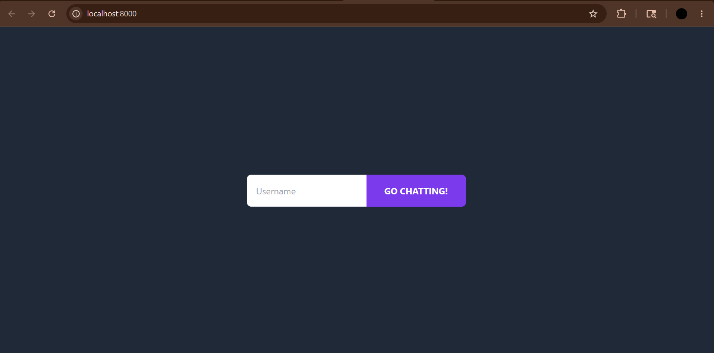
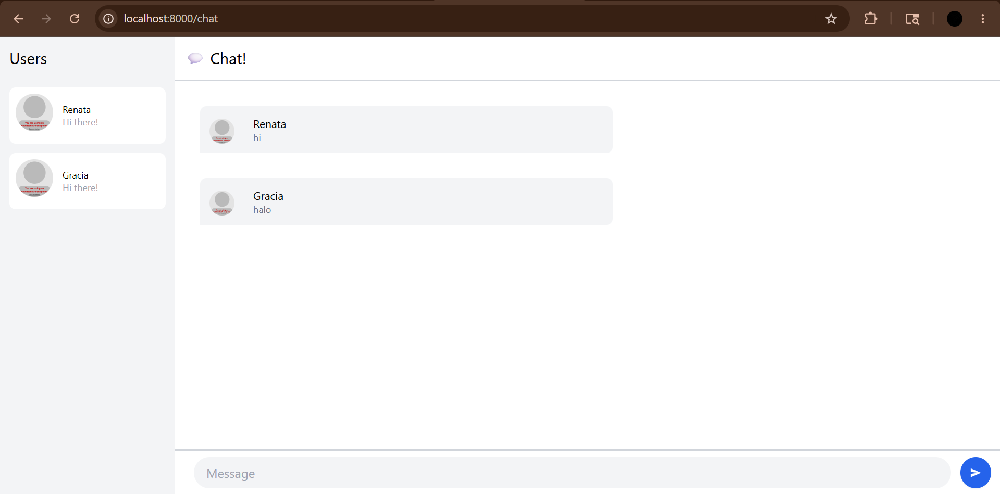
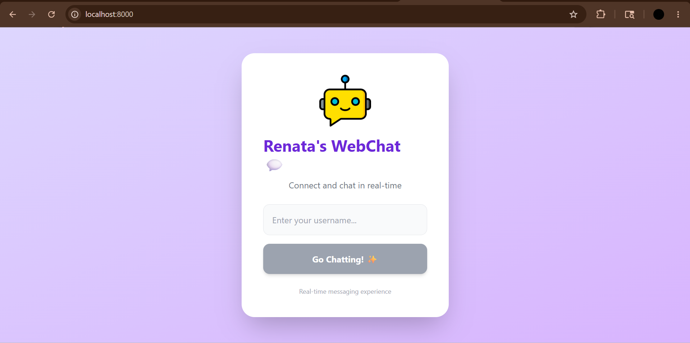
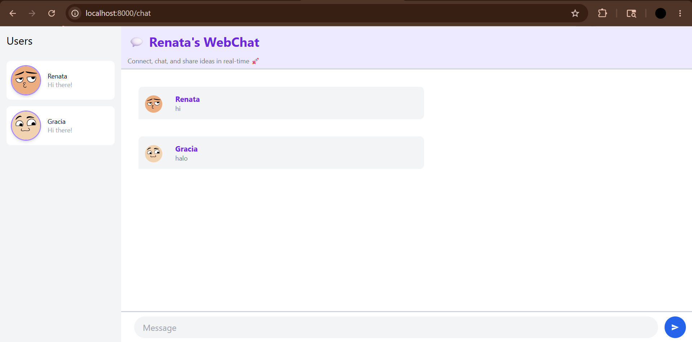

# Experiment 3.1: Original code

Pada eksperimen ini, saya menjalankan aplikasi web chat berbasis Yew dan websocket. Aplikasi terdiri dari dua bagian, yaitu websocket server berbasis NodeJS dan web client berbasis Rust menggunakan framework Yew. Untuk menjalankan server, saya melakukan `npm install` lalu `npm start` pada project SimpleWebsocketServer. Setelah itu, saya menjalankan project YewChat menggunakan `npm install` dan `npm start`, kemudian membuka aplikasi melalui browser. Aplikasi berhasil menampilkan halaman login dan halaman chat yang dapat digunakan oleh beberapa user secara bersamaan. Ketika salah satu user mengirim pesan, pesan tersebut langsung muncul secara real-time pada browser user lain melalui websocket connection. Dari eksperimen ini, saya memahami bagaimana asynchronous websocket communication digunakan untuk membuat aplikasi chat berbasis web secara real-time.

# Experiment 3.2: Add some creativities to the webclient

Pada eksperimen ini, saya menambahkan beberapa kreativitas pada tampilan web client YewChat agar terlihat lebih modern dan menarik. Beberapa perubahan yang saya lakukan yaitu:
- Mengganti halaman login dengan desain card layout dan background gradient
- Menambahkan icon/chat illustration pada halaman login
- Mengubah tampilan tombol dan input agar lebih interaktif
- Menambahkan header “Renata’s WebChat 💬” pada halaman chat
- Menambahkan avatar profile otomatis menggunakan DiceBear API
- Memperbaiki tampilan chat bubble dengan rounded corner dan warna yang lebih clean
- Menyesuaikan spacing dan typography agar UI lebih rapi dan nyaman dilihat
Melalui eksperimen ini saya belajar bagaimana mengombinasikan Yew dan Tailwind CSS untuk membuat tampilan aplikasi yang lebih menarik dibandingkan tampilan default sebelumnya.